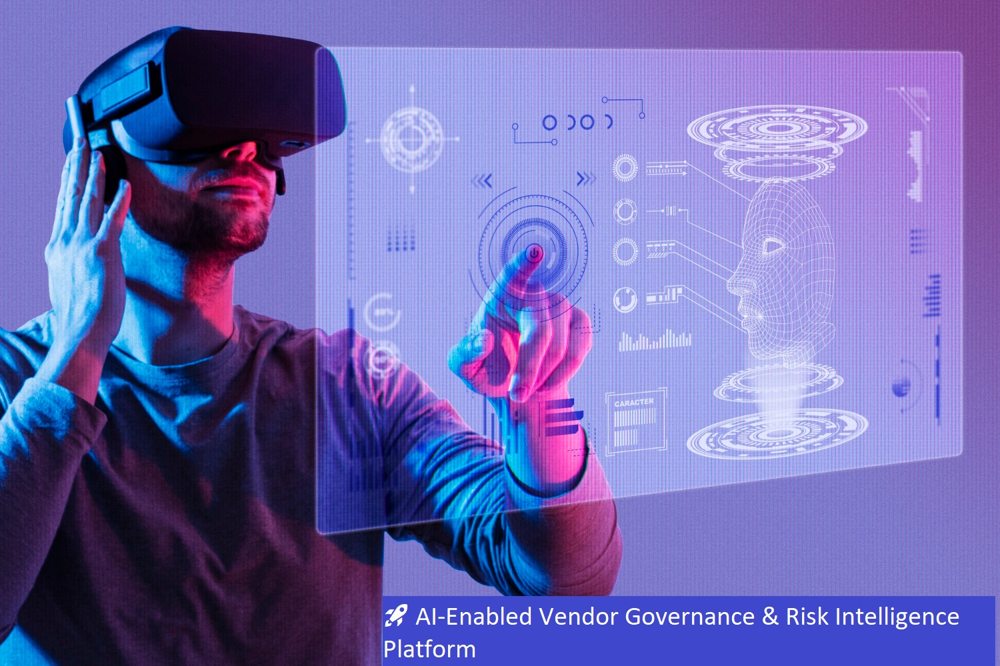
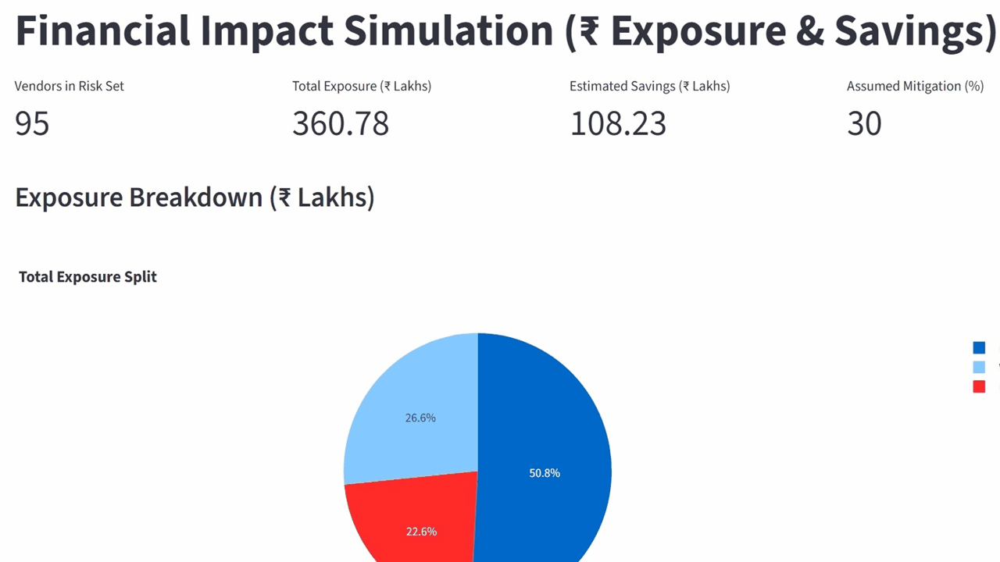
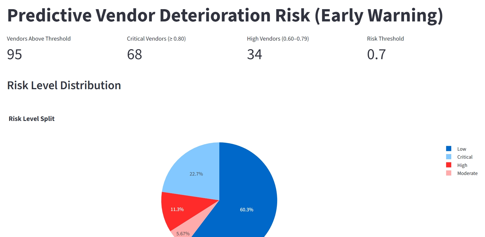
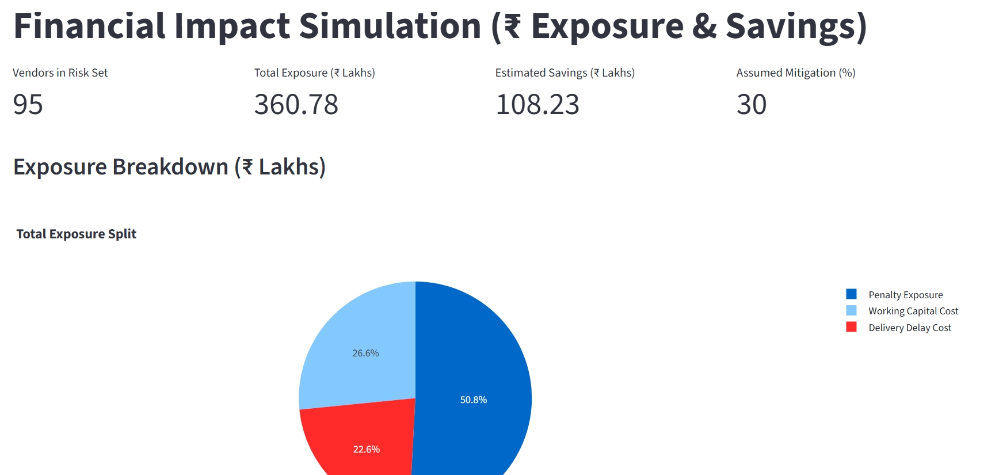
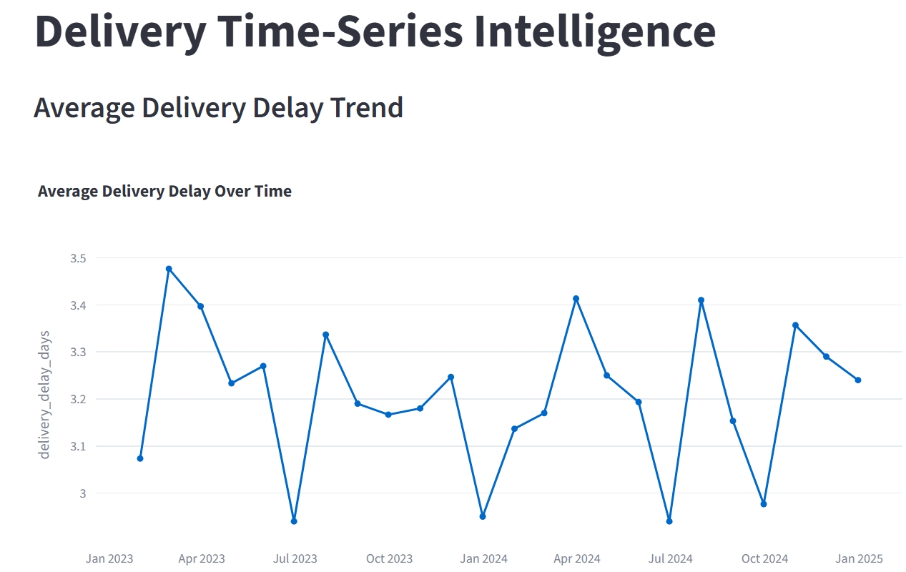
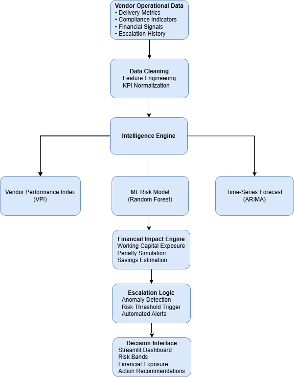

<p align="center">
  
</p>

<h1 align="center">AI Vendor Governance & Risk Intelligence</h1>

<p align="center">
  Turning reactive vendor escalation into <b>predictive risk scoring</b>, <b>financial impact analysis</b>, and <b>time-series intelligence</b>.
</p>

<p align="center">
  <a href="#-demo">Demo</a> •
  <a href="#-key-features">Key Features</a> •
  <a href="#-architecture">Architecture</a> •
  <a href="#-quickstart">Quickstart</a> •
  <a href="#-roadmap">Roadmap</a>
</p>

## 🧰 Tech Stack

<p align="center">
  
  
  
  
  
</p>

<p align="center">
  
</p>

## 🧠 Intelligence Delivered

<p align="center">
  
</p>

---

## 👋 About Me
I’m **Imran Sayyed**, Senior Manager with **17+ years** in telecom vendor operations, compliance, and cost governance.  
I build AI-driven governance systems that reduce leakage, improve performance, and automate controls.

---

## 🎥 Demo
<p align="center">
  
</p>

<details>
  <summary><b>📸 Screenshot Gallery</b> (click to expand)</summary>

  <p align="center">
    
    
    
  </p>
</details>

---

## ✨ Key Features
- **Vendor Performance Index (VPI)** with business-weighted scoring
- **ML-based Risk Classification** (High / Medium / Low) for proactive governance
- **Financial Impact Analyzer** to estimate leakage & prioritize interventions
- **Time-Series Forecasting** (ARIMA) + **anomaly-based escalation**
- **Action Tracking Dashboard** for governance closure and accountability

---

## 🧩 Architecture
<p align="center">
  
</p>

---

## ⚙️ Quickstart
```bash
pip install -r requirements.txt
streamlit run app.py