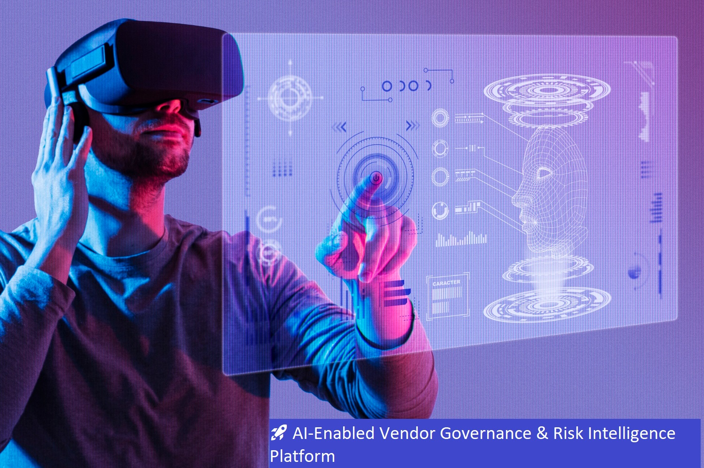
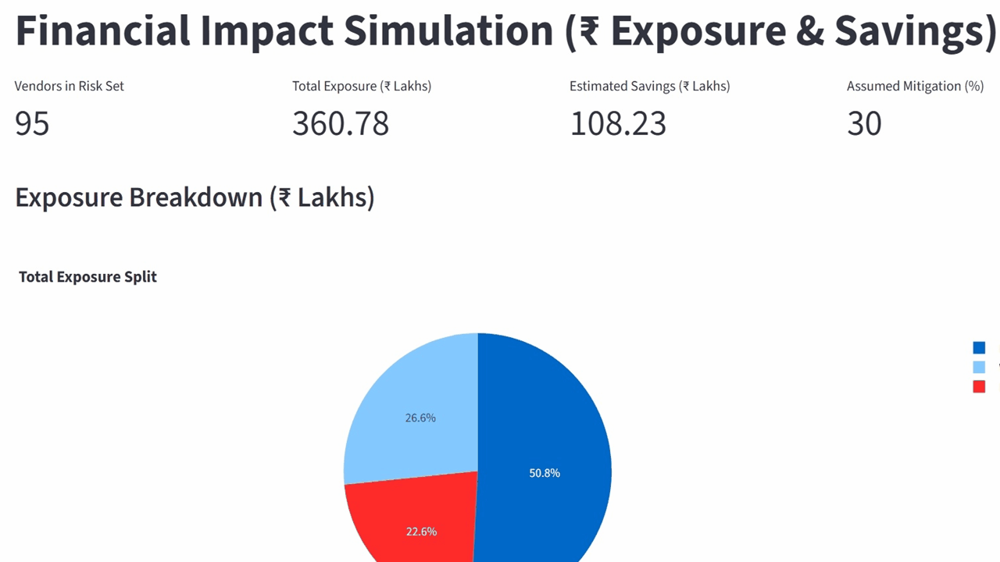
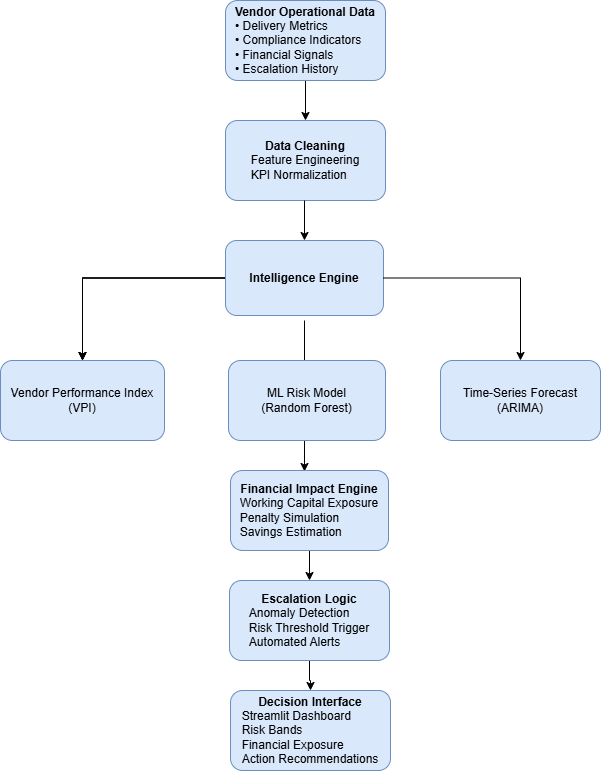

<p align="center">
  
</p>

<h1 align="center">AI Vendor Governance & Risk Intelligence System</h1>

<p align="center">
  End-to-End Vendor Risk Intelligence Platform with Machine Learning, Forecasting, and a Streamlit Dashboard
</p>

<p align="center">
  <a href="#-demo">Demo</a> •
  <a href="#-key-features">Key Features</a> •
  <a href="#-architecture">Architecture</a> •
  <a href="#-quickstart">Quickstart</a> •
  <a href="#-roadmap">Roadmap</a>
</p>

---

## 🧠 Intelligence Delivered

<p align="center">
  
</p>

---

## 🧰 Tech Stack

<p align="center">
  
  
  
  
  
</p>

<p align="center">
  
</p>

---

## 👋 About Me

I’m **Imran Sayyed**, Senior Manager with **17+ years** in telecom vendor operations, compliance, and cost governance.

I build **enterprise-oriented AI systems** focused on:
- Vendor governance
- Financial risk control
- Process automation

My goal is to bridge **domain expertise + data science** to create systems that deliver real business impact.

---

## 🎥 Demo

<p align="center">
  
</p>

---

## ✨ Key Features

- **Vendor Performance Index (VPI)** with business-weighted scoring
- **Predictive Risk Classification** using Machine Learning
- **Financial Impact Analyzer** to estimate leakage and prioritize actions
- **Time-Series Forecasting (ARIMA)** for delivery trend prediction
- **Anomaly Detection** for early escalation signals
- **Action Recommendation Engine** for governance decisions

---

## 🧠 ML Methodology

### Data Layer
- Vendor KPIs
- Compliance indicators
- Invoice and payment signals
- Delivery timelines

### Feature Engineering
- Delay ratios
- Cost variance
- Escalation frequency
- Performance volatility

### Model
- Logistic Regression (selected via cross-validation)
- Compared with Random Forest, Gradient Boosting, and SVM
- Class imbalance handled using `class_weight="balanced"`
- Risk scoring using predicted probabilities

## 📊 Model Performance

Best model selected via Stratified 5-Fold Cross Validation.

| Metric | Value |
|------|------|
| ROC-AUC | 0.983 |
| Accuracy | 92.2% |
| Precision | 85.0% |
| Recall | 97.1% |
| F1 Score | 90.7% |

The model is optimized for **high recall**, ensuring early detection of high-risk vendors.

### 📈 Forecasting
- ARIMA (3-month prediction)
- Rolling Z-score anomaly detection

### 🎯 Output
- Risk Band (Low / Moderate / High / Critical)
- Financial Exposure Estimate
- Action Recommendation

---

## 🧩 Architecture

<p align="center">
  
</p>

**Execution Flow:**
- Notebook performs full data processing, modeling, and forecasting
- Outputs are saved as processed artifacts
- Streamlit dashboard consumes these artifacts for visualization

---

## ⚙️ Quickstart

```bash
pip install -r requirements.txt
streamlit run app.py

---

## 🛣️ Roadmap

- ✅ Vendor Performance Index
- ✅ Risk Classification Model
- ✅ Financial Impact Simulation
- ✅ Time-Series Forecasting
- ⬜ Model Explainability (SHAP)
- ⬜ Drift Detection & Monitoring
- ⬜ Role-Based Governance Access
- ⬜ Deployment on Streamlit Cloud
- ⬜ CI/CD Integration

---

## 🔄 Model Lifecycle Management
- Data ingestion & preprocessing
- Feature transformation
- Model training & validation
- Artifact versioning
- Deployment layer
- Monitoring & drift detection (planned)
- Governance & audit logging (planned)

---

## 🗂️ Project Structure

```text
.
├── app.py
├── Vendor_Governance.ipynb
├── processed/
│   ├── vendor_dashboard_master.csv
│   ├── monthly_trend.csv
│   ├── delivery_forecast.csv
│   ├── delivery_anomalies.csv
│   ├── model_drivers.csv
│   ├── model_metrics.csv
│   └── artifact_manifest.json
├── models/
│   └── risk_model.pkl
├── assets/
│   ├── banner.jpg
│   ├── dashboard_demo.gif
│   ├── architecture.png
│   └── logos/
├── requirements.txt
└── README.md
```

---

## 📫 Contact

**Imran Sayyed**  
Senior Manager | AI & Data Science | Vendor Governance Automation  

- 🔗 GitHub: https://github.com/imran-ai-ds  
- 🔗 LinkedIn: https://www.linkedin.com/in/imran-sayyed-77293759  
- 📍 Mumbai / Pune (Open to Remote & Global Roles)

- Note : Dataset used is synthetic / anonymized for demonstration purposes.